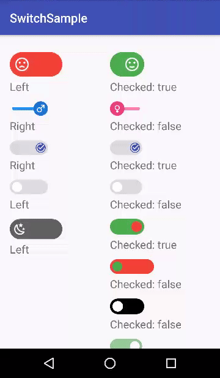

RMSwitch
======



A simple View that works like a switch, but with more customizations

Download
------
####Gradle:
```groovy
compile 'com.rm:rmswitch:1.0.1'
```

## Usage

To use it, just add this to your layout file

### Two-states switch
```xml
    <com.rm.rmswitch.RMSwitch
                android:id="@+id/your_id"
                android:layout_width="wrap_content"
                android:layout_height="wrap_content" />
```
### Three-state switch
```xml
    <com.rm.rmswitch.RMTristateSwitch
                        android:id="@+id/rm_triswitch1"
                        android:layout_width="wrap_content"
                        android:layout_height="wrap_content" />
```

... if you need to use this View's custom xml attributes (shown in a table below) do not forget to add this to your root layout
```
xmlns:app="http://schemas.android.com/apk/res-auto"
```


To see how it looks in the preview screen of Android Studio, build your project first

And this in your Activity
```java
public class MainActivity extends AppCompatActivity {
    RMSwitch mSwitch;
    
    @Override
    protected void onCreate(Bundle savedInstanceState) {
        super.onCreate(savedInstanceState);
        setContentView(R.layout.activity_main);
        
        mSwitch = (RMSwitch) findViewById(R.id.your_id);
        
        // Add a Switch state observer
        mSwitch.addSwitchObserver(new RMSwitch.RMSwitchObserver() {
            @Override
            public void onCheckStateChange(boolean isChecked) {
                                Toast.makeText(MainActivity.this, "Switch state: " + 
                                        (isChecked ? "checked" : "not checked"), Toast.LENGTH_LONG)
                                        .show();
            }
        });
}
```

####Supported Attributes
| XML Attribute                 | Java method                                                     	| Description                                                                                                     	| Default value                                      	            |
|-------------------------	    |-----------------------------------------------------------------	|-----------------------------------------------------------------------------------------------------------------	|----------------------------------------------------	            |
| checked                  	    | setChecked(boolean checked)                                     	| The initial state of the Switch, if checked or not                                                              	| false                                              	            |
| enabled                  	    | setEnabled(boolean enabled)                                     	| If not enabled, the Switch will not be clickable, but it is still possible to change its state programmatically 	| true                                               	            |
| forceAspectRatio         	    | setForceAspectRatio(boolean forceAspectRatio)                   	| Force the Switch aspect ratio                                                                                   	| true                                               	            |
| switchBkgCheckedColor    	    | setSwitchBkgCheckedColor(@ColorInt int color)                   	| The background color of the Switch if checked                                                                   	| your current theme colorControlHighlight attribute 	            |
| switchBkgNotCheckedColor 	    | setSwitchBkgNotCheckedColor(@ColorInt int color)                	| The background color of the Switch if not checked                                                               	| the same as switchBkgCheckedColor                	                |
| switchToggleCheckedColor      | setSwitchToggleCheckedColor(@ColorInt int color)                	| The color of the Switch toggle if checked                                                                       	| your current theme colorAccent attribute           	            |
| switchToggleNotCheckedColor   | setSwitchToggleNotCheckedColor(@ColorInt int color)             	| The color of the Switch toggle if not checked                                                                   	| white                                              	            |
| switchToggleCheckedImage      | setSwitchToggleCheckedDrawableRes(@DrawableRes int drawable)    	| The image to be shown on the toggle if checked                                                                  	| the same as switchToggleNotCheckedImage if set, none otherwise    |
| switchToggleNotCheckedImage   | setSwitchToggleNotCheckedDrawableRes(@DrawableRes int drawable) 	| The image to be shown on the toggle if not checked                                                              	| the same as switchToggleCheckedImage if set, none otherwise       |

The changes between the Switch states will be automatically cross-faded, to obtain a smooth experience